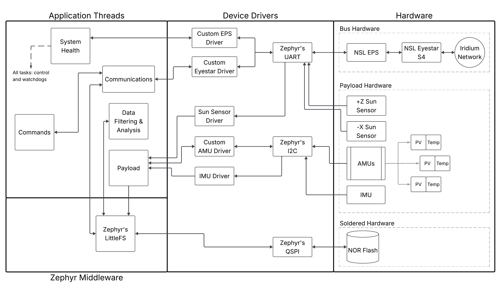

# Flight Software Architecture

Updated: 9/2/26

PEROVSAT flight software runs on [Zephyr RTOS](https://docs.zephyrproject.org/), split into threaded application code and driver code

## High-level layout

PEROVSAT's architecture follows a three-layered approach.

At the base, **Zephyr's communication drivers** handle the wire-level interactions with our hardware. See their [I2C driver](https://docs.zephyrproject.org/latest/doxygen/html/group__i2c__interface.html) for an example

On top of those, we build **device drivers** that understand how a specific device works, and can expose a clean API to it. For example, imagine you need to read the sun sensor to see if the payload is facing the sun. Instead of having to know the UART text to read each time, the [sun sensor driver](../../reference/drivers/sun-sensor.md) could simply supply `z_sun_sensor.read_angle()`

Finally, the **application layer** threads act as the high level control of PEROVSAT's operation. They know things like how to process [commands](threads/commands.md), [compress data](threads/data-filtering-and-analysis.md), and make sure everything is running smoothly.

## Data Flow

This diagram shows the data flow connections between all aspects of PEROVSAT. The diagram is useful for tracing how the layers work:

- The Payload thread needs to read the sun sensor, so it issues a simple API call
- The sun sensor driver receives that, and issues the corresponding UART command to Zephyr's UART driver
- The UART driver interacts with hardware to get that command over the wire
- The response is sent back up the chain for the payload thread to get its final data

For reliablity reasons, application threads rarely communicate with one another. Rather, they receive and save data to the filesystem on NOR flash, which is largely immune to radiation events. Then, on a periodic model, a thread can just check if there are any new files available for it to work on.
