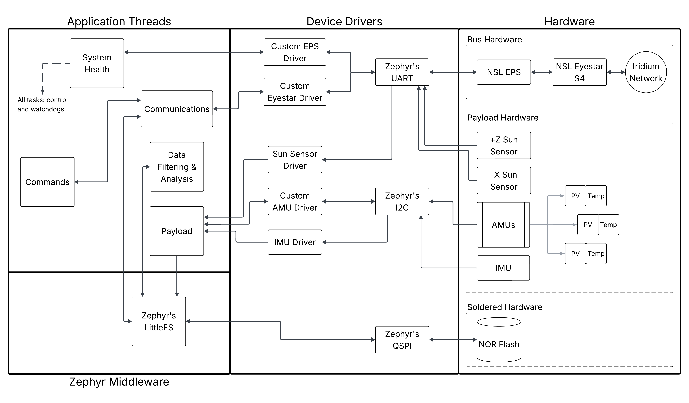

# Flight Software Architecture

Updated: 9/29/26

!!! note "Active Project"
    Much of the work described here is the target design. Implementation of much of it is incomplete, but relevant documentation will be updated as we complete parts

PEROVSAT flight software runs on [Zephyr RTOS](https://docs.zephyrproject.org/), split into threaded application code and driver code

## High-level layout

PEROVSAT's architecture follows a three-layered approach.

At the base, **Zephyr's communication drivers** handle the wire-level interactions with our hardware. See their [I2C driver](https://docs.zephyrproject.org/latest/doxygen/html/group__i2c__interface.html) for an example

On top of those, we build **device drivers** that understand how a specific device works, and can expose a clean API to it. For example, imagine we wanted to read the Interial Measurement Unit (IMU) in the payload thread. Instead of having to know the I2C registers to read each time, the MPU6050 driver could simply supply `mpu6050_sample_fetch()` and handle everything behind the scenes

Finally, the **application layer** threads act as the high level control of PEROVSAT's operation. They know things like how to process [commands](threads/commands.md), [compress data](threads/data-filtering-and-analysis.md), and make sure everything is running smoothly.

## Data Flow

!!! warning "Undergoing changes"
    Due to some power constraints and chaning mission requirements, the hardware modeled here may not be fully accurate

This diagram shows the data flow connections between all aspects of PEROVSAT. The diagram is useful for tracing how the layers work:

- The Payload thread needs to read the IMU, so it issues a simple API call
- The MPU6050 driver receives that, and issues the corresponding I2C command to Zephyr's I2C driver
- The I2C driver interacts with hardware to get that command over the wire
- The response is sent back up the chain for the payload thread to get its final data

For [reliability](../reliability/index.md) reasons, application threads rarely communicate directly. Rather, they store their data on the filesystem persistently for the next stage to read.
